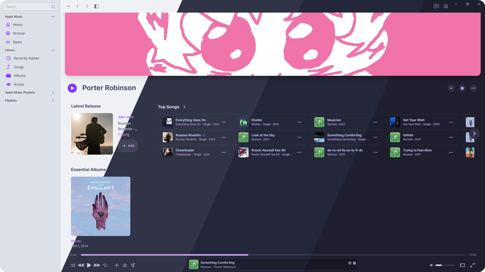
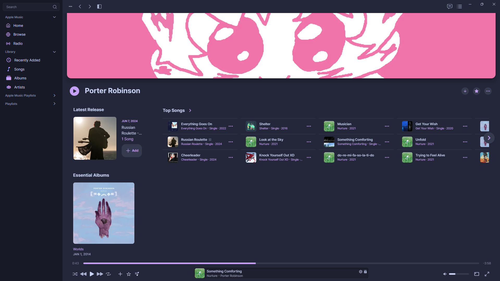

<h3 align="center">
	 
	
	Catppuccin for <a href="https://github.com/ciderapp">Cider</a>
	
</h3>

	
	
	

	

## Previews

🌻 Latte

🪴 Frappé

🌺 Macchiato

🌿 Mocha

## Usage

1. Download your preferred flavor and accent from the [themes](themes/) directory.
2. Open Cider
3. Go to Settings → Experiments → Enable Theme Support.
4. Go to Theme Manager → Install from File → (Your downloaded theme file).
5. Go to Settings → Visual → Color Scheme:
   - Use **Light** if using Latte.
   - Use **Dark** if using Frappé, Macchiato, or Mocha.

## Notes

### Immersive / Coverflow Mode

Immersive and Coverflow modes uses **dark-mode** theming in-app. If you're using a Latte theme, it is recommended that you also **enable** a dark-mode theme (Frappé / Macchiato / Mocha) to have theming inside the Immersive and Coverflow modes.

## 💝 Thanks to

- [winston](https://github.com/nekowinston)
- [Eli](https://github.com/Flapperoo)

&nbsp;

	

	Copyright &copy; 2021-present <a href="https://github.com/catppuccin" target="_blank">Catppuccin Org</a>

	

